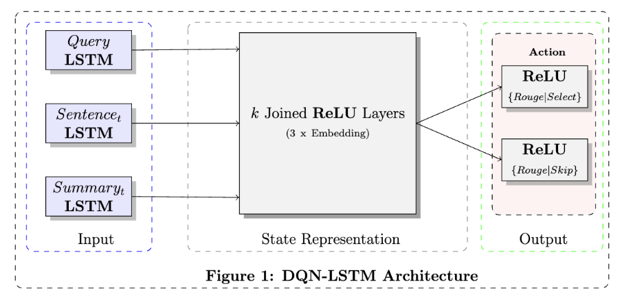

# Deep Q-Learning for Event Summarization

Repo currently has 3 folders

    Code
    Paper
    Presentation

This is the repository for our {Francisco Javier Arceo, Chris Kedzie} implementation 
of our Deep Q-Network using a Long Short Term Memory (DQN-LSTM) for Event Summarization (2016).

At a high-level, the algorithm works like so:

    

To run the code simply enter in the command line:

    th Code/runModelProd.lua --model lstm

The relevant code files in the **/Code** folder are

1. Utils/build_data.py
2. utils.lua
3. utilsNN.lua
4. runModelProd.lua
5. runModel.lua

The files in the **/Paper** folder are related to the TeX document to create the paper.

# License

MIT

## Notebooks

1. Run FinalProcessing.ipynb
2. Pytorch DQN Summarization.ipynb
